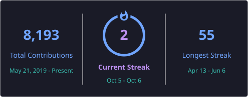

### 👋 Hi, I’m Pedro Girú Nunes
Backend Developer at Mais Centro Clínico · Co-founder at Kronic

<i>I don’t know what you’re looking for here, but I truly hope you find it.</i>

**Kronic** · co-founder · AI-powered platform for clinics 
**SysCMS** · backend author · CRM behind Cartão Mais Saúde 
**ISP networks** · where it started · fiber, BGP and RouterOS

### :clipboard: Technologies

### :hammer_and_wrench: IDEs

![Orca](https://img.shields.io/badge/Orca-1a1b27?style=for-the-badge&logo=data%3Aimage%2Fpng%3Bbase64%2CiVBORw0KGgoAAAANSUhEUgAAACAAAAAgCAYAAABzenr0AAAABGdBTUEAALGPC%2FxhBQAAACBjSFJNAAB6JgAAgIQAAPoAAACA6AAAdTAAAOpgAAA6mAAAF3CculE8AAAAeGVYSWZNTQAqAAAACAAEARoABQAAAAEAAAA%2BARsABQAAAAEAAABGASgAAwAAAAEAAgAAh2kABAAAAAEAAABOAAAAAAAAAJAAAAABAAAAkAAAAAEAA6ABAAMAAAABAAEAAKACAAQAAAABAAAAIKADAAQAAAABAAAAIAAAAAB%2BC9pSAAAACXBIWXMAABYlAAAWJQFJUiTwAAABzWlUWHRYTUw6Y29tLmFkb2JlLnhtcAAAAAAAPHg6eG1wbWV0YSB4bWxuczp4PSJhZG9iZTpuczptZXRhLyIgeDp4bXB0az0iWE1QIENvcmUgNi4wLjAiPgogICA8cmRmOlJERiB4bWxuczpyZGY9Imh0dHA6Ly93d3cudzMub3JnLzE5OTkvMDIvMjItcmRmLXN5bnRheC1ucyMiPgogICAgICA8cmRmOkRlc2NyaXB0aW9uIHJkZjphYm91dD0iIgogICAgICAgICAgICB4bWxuczpleGlmPSJodHRwOi8vbnMuYWRvYmUuY29tL2V4aWYvMS4wLyI%2BCiAgICAgICAgIDxleGlmOkNvbG9yU3BhY2U%2BMTwvZXhpZjpDb2xvclNwYWNlPgogICAgICAgICA8ZXhpZjpQaXhlbFhEaW1lbnNpb24%2BMTAyNDwvZXhpZjpQaXhlbFhEaW1lbnNpb24%2BCiAgICAgICAgIDxleGlmOlBpeGVsWURpbWVuc2lvbj4xMDI0PC9leGlmOlBpeGVsWURpbWVuc2lvbj4KICAgICAgPC9yZGY6RGVzY3JpcHRpb24%2BCiAgIDwvcmRmOlJERj4KPC94OnhtcG1ldGE%2BCsHtO6kAAASoSURBVFgJ7VZLSGNZEK1oookKfqKou%2FjBGRod6G57XIi4kgaFEcSFO1eK22kcENeCYG9EVFxrg4yg4Kgo7sZBUDOtERXG%2BAH%2FIn7iLyYm8U2da276vfiSCUPDzKJLrvfm3bpVp6pO3feIvsl%2FnAFDJP%2BKoiT29vaWXl5efv%2Fw8JDp9%2FstgUDAwDM9PT0RZjkeHx%2FFWs4%2Bn0%2FhvQfWO%2Bczf6WkpPw5PT3t1fOlC6Cnp6diY2Pj48HBwY%2Fs3MBGhFNpgMHJJcl1xJk1TEbTEh%2F4ZX5%2B%2Fo%2FQweDiBQA4X1hY%2BM3pdKbBscHwrCLncAOx%2FI6LiyOj0eji%2BadwEPFqAxMTE0lzc3O%2Frq2t5SPNakGE%2F3bAFg8z2%2FshJyfn08nJiU%2FaNsoFZnb8bm9v763X66X4eA02tdqLtQSGSCNJkDtvORPvWOd3qacBcHV19er29lbUW9ZUKkabUZ6MjAw6Pz8XJZPZiwDoVUQA7ju3FdH7A34y8F8sAmfZ2dmUl5dH%2B%2Fv7InPp6elivr6%2BDpEUtoJBWdV2NRnw%2BrxmbiEK%2BL%2BQT62st0br5ebm0uHhodhub2%2Bnqqoqcm456cPPH%2Bjs7AwEFHuJiYnEWQEXQqIBwHUSfY56xcp6RXmitLQ0Wl1dFWfGxsZodHSUkpKSqLS0lOAU3YTod3Z2kCVNajUA5EWCA7EIboOU5GTCOZfLJbjD9wa1tbVReXm5ACEDWVlZodbWVnFhqW2%2FAIASxJoB6GXZbMRtRXd3d1RXV0fd3d0iI9iDrd3dXRocHKShoSECOPBFLRoAgoB8MNYMIPKsrCxyOBwi3V1dXWQ2m4m7CS1NKMfk5CSdnp6KbKAc4aIBIEsA9LEIyIUBtg8MDAgndrudOjs7aXFxkdxuN1ksFh5JggOwG96aGgBujyf0gpG1iwREth9Y%2Fub1ayopKRFRNzc30%2Fb2NiUzN%2BAcEuC2BglhMyoAL9dItGGQtTisBwTGPAw2Pz%2Bftra2CE7v7%2B%2Bpo6NDOIdjAJQXEuxA4DwqABhFmkAWRGAymUR6gxfIsxX%2BDwf19fVUVlZGS0tLYh4ZGaHZ2VlREtl2oQPBhV4w2hJwzUDE2tpaamhoEMbQu%2Bvr64LpeD8UFBRQRUUFFRcXi1oXFhaKSPv7%2B4UbvcixgSDCo8dzDYCLiwuqrKykpqYmwjsBYJDmoqIi6ApHIBZAjY%2BP08zMDLW0tNDw8DAdHx%2BHdMRC558eCA0AZrSyvLxMjY2NodrjEAYiQ3nQKRgQtBx%2F7VBfX5%2BOO%2F1HnIUvXzOsogHATjzhLxB9M89P8QJCFnAJxSLgAAfpUetqAHAHXEIJEcciR0dHxF9OsagKHXCIL6NL9QENAGbvph5T1QfU65ubG%2FXPf1w%2FX0qWTbWi5hOG0dk5RQ61wtdaIzD%2BHHNYrVZ7VJvc%2F1Xc%2Fy5WQh2%2BymDnis1mc1VXV1dFdS43GcR7zsZnrpkC1sKAHPiNgT0MdA4Ggw6NhIQEhc8r%2FE2gZGZmKnxnfK6pqXkv7atnzceBeiM1NTWd266MO%2BM7dm5lYprZsYGdiRtSzuxMXFggGJ6xDgbAeRjEBQezyc8Xp6amrtT2v63%2FNxn4G5%2Bjz%2BM7w2DfAAAAAElFTkSuQmCC)

### ⚙️ Hypervisors

 

### 📊 GitHub Stats

